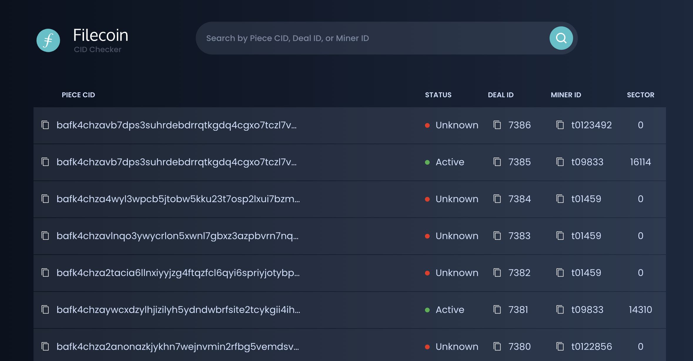

# filecoin-cid-checker

A website ([filecoin.tools](https://filecoin.tools)) and [API service](https://documenter.getpostman.com/view/6638692/T17AiA6S?version=latest) that can list all CIDs along with their current storage and deal status in the latest state tree.

It supports queries by CID or Miner ID or Deal ID.

This project was built as a Wave 3 [Filecoin dev grant](https://github.com/filecoin-project/devgrants#filecoin-devgrants) by [Protofire](https://github.com/protofire).

## Hosted CID checker service

1. Navigate to: [filecoin.tools](https://filecoin.tools)
2. See the list of all file CIDs and related information by
   - Deal ID
   - Miner ID
   - Sector number
   - Status
3. Search a record by a Piece CID, Deal ID, or Miner ID (by Payload / Data CID is a future feature)
4. Click on a chosen record and see other related details

**If you are running an own Filecoin (Lotus) node:**

Install the CID checker as a sidecar to your Filecoin (Lotus) node: see [deployment instructions at the source repo](https://github.com/protofire/filecoin-CID-checker#deployment).

**If you are an application developer:**

API endpoints available to be used as a Storage Oracle see the [API section at the source repo](https://github.com/protofire/filecoin-CID-checker/blob/master/README.md#api).

## Data Mapping

## Source code

The source and more project info is available at https://github.com/protofire/filecoin-CID-checker/

## License

All linked repos for this project are dual-licensed under:

[MIT](https://github.com/filecoin-project/lotus/blob/master/LICENSE-MIT)

[Apache 2.0](https://github.com/filecoin-project/lotus/blob/master/LICENSE-APACHE)
